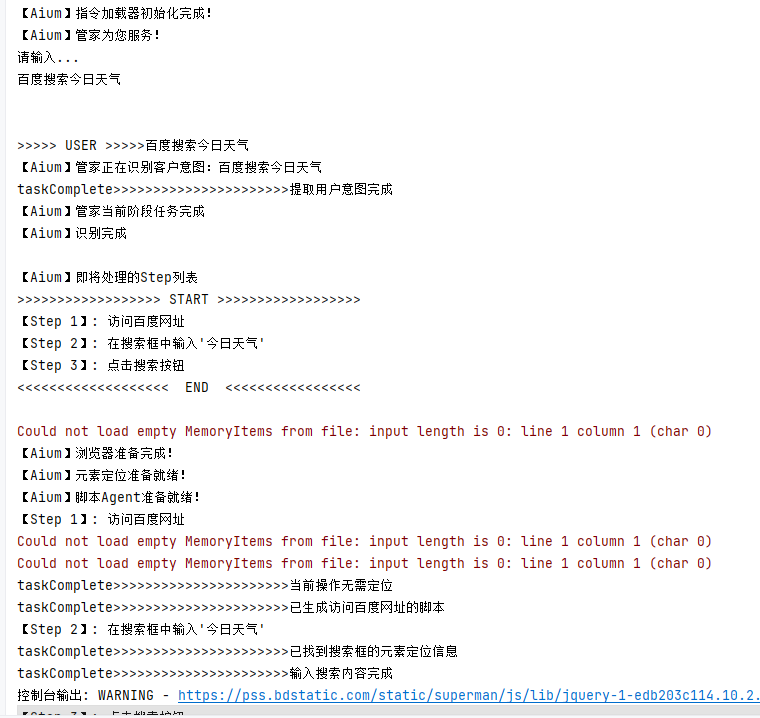
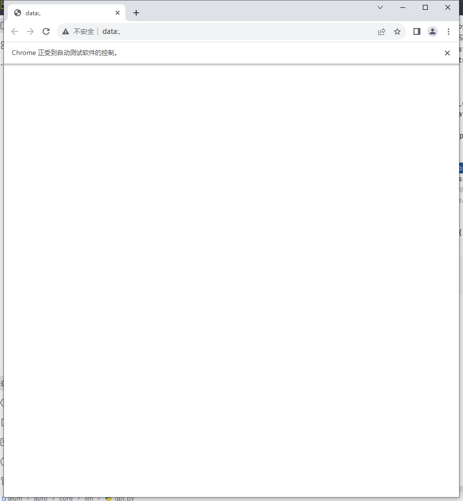
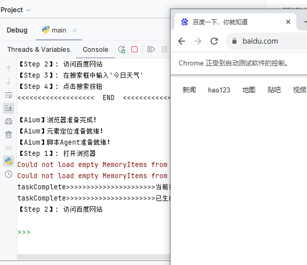

<h1 align="center">
 ChatAium
</h1>

  <strong>
    📝 基于Python、Selenium、Webdriver、LLM构建，基于Auto-gpt以及Tencent无极平台的思考而建立。
  </strong>

 

  
  

    👋 持续迭代

*Read this in [English](README_en.md).*

## 背景初衷
ChatAium 以一款基于对话形式操作浏览器的应用，基于LLM的能力，简化自动化测试的痛点问题。
 
* 1、页面布局经常改变，元素维护复杂
* 2、浏览器驱动版本不好维护
* 3、对于开发能力较弱的用户编写脚本测试不友好
* 4、其他

本人从事于某开源项目，有兴趣一起交流或者一起完善本项目的小伙伴，可以一起学习交流。

## 功能支持

- [x] 🎉 基础根据描述进行浏览器任务拆解流程；
- [x] 🎉 基础AI驱动浏览器操作能力；
- [ ] 🍀 变量管理；
- [ ] 📝 断言及数据提取；
- [ ] 🛠 前后置操作；
- [ ] 🏁 日志监控；
- [ ] 💃🏻 Memory优化；
- [ ] ✨ 多节点管理中心；
- [ ] 🚑 并行批量执行；
- [ ] ✨ 网页观测平台；

## 示例

## 特别鸣谢

 🙌

## License

[MIT](http://opensource.org/licenses/MIT)

